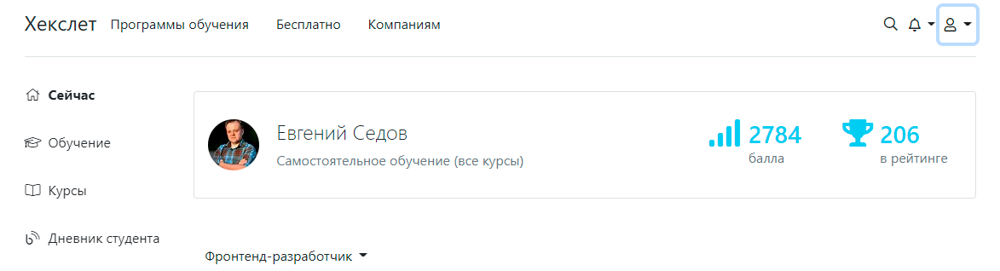

**[Link to my cv in the markdown format](https://EvSedov.github.io/rsschool-cv/cv)**

# Evgeniy Sedov

### I am passionate about programming

---

## My contacts

**Phone:** +79232402712

**Telegram:** @evsedov

**Slack:** evgeniy.sedov

**E-mail:** 79232402712@yandex.ru

---

## Briefly about myself

I like to solve interesting problems, try to find elegant solutions. In programming, i found this. Programming allows me to hone this skill endlessly, develops my brain and makes my life rich and interesting. I like to study different programming paradigms by looking at how they are implemented in programming languages, such as: JavaScript, Python, Ruby, Haskell and others.

---

## My skills

- JavaScript
- Ruby on Rails (basickbasic knowledge framework)
- HTML5
- CSS3
- Git/GitHub

---

## Code examples

The code example is taken from my project "Difference calculator" on GitHub:

```JavaScript
const stringify = (data, ancestry = '') => {
  const currentKey = ancestry;
  const { type, key } = data;
  const compositeKey = getKey(currentKey, key);
  return collectionOfStrings[type](compositeKey, data);
};
```

---

## Experience

**I made several training projects that I posted on github, here are the links to them:**

- **[Brain-Games](https://github.com/EvSedov/brain-games)**  
  Set of mini games. If you want to have fun and "stretch your brains", install a set of mini-games on your computer, play and have fun.

- **[Difference calculator](https://github.com/EvSedov/frontend-project-lvl2)**  
  Compares two configuration files and shows a difference.

- **[Pokemon-game](https://github.com/EvSedov/pokemon-game)** (work in progress)  
  A card game based on cartoons about Pokemon. If you want to play, then follow [this link](https://evs-pokemon-game.netlify.app/).

- **[Task Manager](https://github.com/EvSedov/TaskManager)** (work in progress)  
  Task Manager - web project written in Ruby on Rails.  
  [Task Manager deployed on Heroku](https://sev-task-manager.herokuapp.com/)

---

## Education

### Courses:

- **Hexlet**  
  The main platform for my study of programming is a courses from Hexlet.

[](https://ru.hexlet.io/u/kokchix)

- **RSSchool**

---

## English language

Level А1 (breakthrough or beginner).
